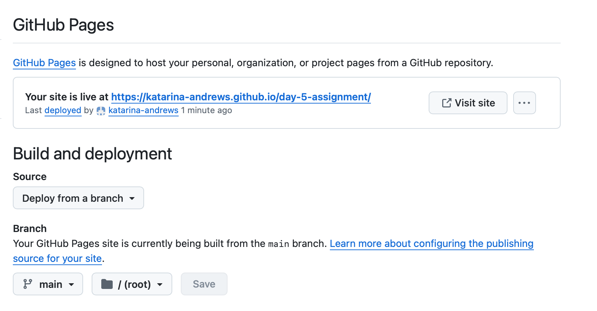
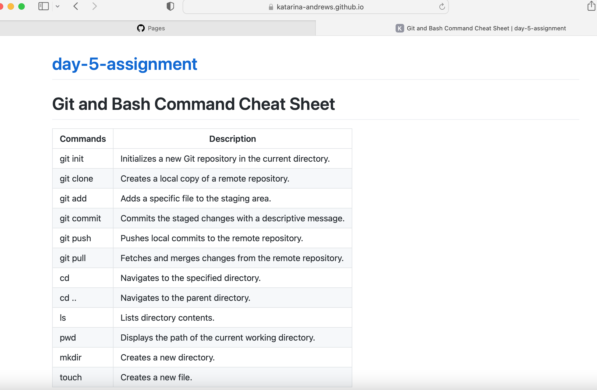
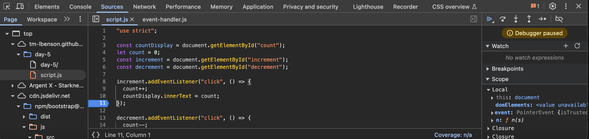

# Git and Bash Command Cheat Sheet 

| Commands    | Description                                                |
|-------------|------------------------------------------------------------|
| git init    | Initializes a new Git repository in the current directory. |
| git clone   | Creates a local copy of a remote repository.               |
| git add     | Adds a specific file to the staging area.                  |
| git commit  | Commits the staged changes with a descriptive message.     |
| git push    | Pushes local commits to the remote repository.             |
| git pull    | Fetches and merges changes from the remote repository.     |
| cd          | Navigates to the specified directory.                      |
| cd ..       | Navigates to the parent directory.                         |
| ls          | Lists directory contents.                                  |
| pwd         | Displays the path of the current working directory.        |
| mkdir       | Creates a new directory.                                   |
| touch       | Creates a new file.                                        |

 
 

# Screenshots

## Part 1: Deploying a Project to GitHub Pages

## Part 2: Building and Deploying a Cheat Sheet

## Part 3: Reviewing Chrome DevTools with Breakpoints

